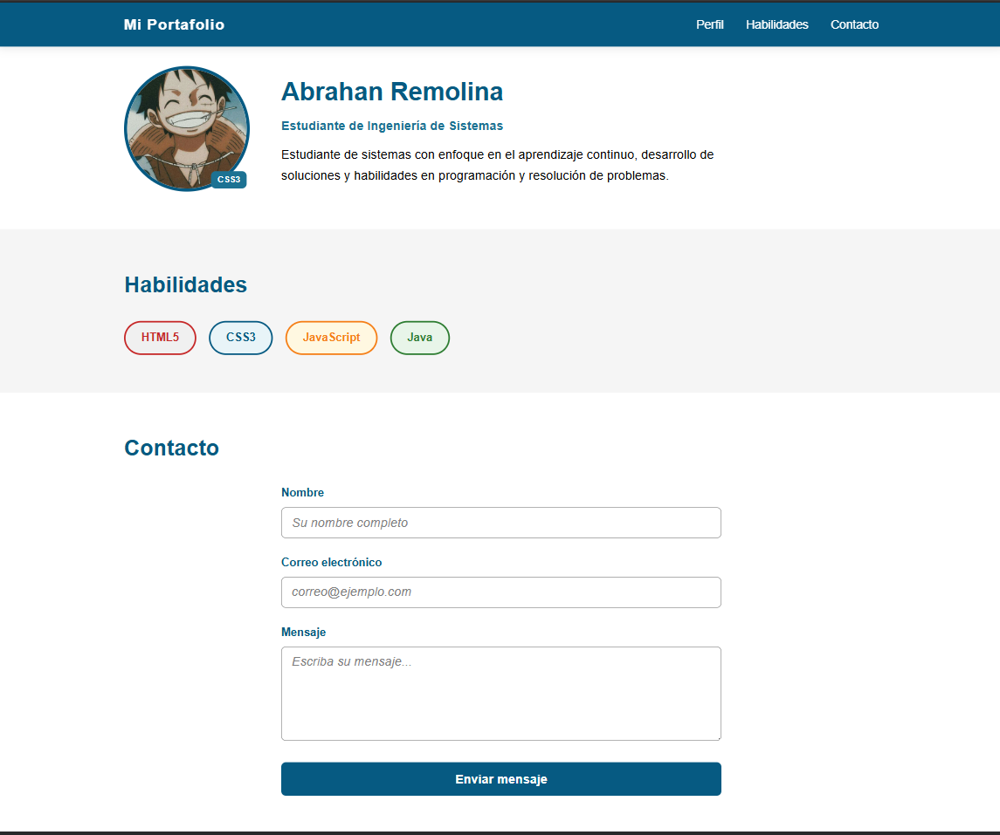

# Proyecto Página Web Personal

**Remolina-post1-u3**  
**Nombre:** Abrahan Remolina Bolívar  
**Carrera:** Ingeniería de Sistemas  
**Asignatura:** Programación Web  
**Unidad:** CSS3 Básico - Post-Contenido 1  

## Descripción del proyecto  
Este proyecto consiste en la creación de una página web personal empleando HTML5 y CSS3. En ella se presentan tres secciones principales:  

- Información personal del estudiante  
- Habilidades y competencias  
- Formulario de contacto  

Durante el desarrollo se implementan diferentes propiedades de CSS3, como selectores, el modelo de caja utilizando `box-sizing: border-box`, distintos tipos de posicionamiento (`fixed`, `relative`, `absolute`) y estilos enfocados en la usabilidad de formularios.  

## Cómo ejecutar el proyecto  
1. Descargar o clonar el repositorio en tu equipo.  
2. Abrir la carpeta del proyecto en Visual Studio Code.  
3. Localizar y abrir el archivo `index.html`.  
4. Ejecutarlo con la extensión Live Server.  
5. Automáticamente se abrirá en el navegador.  

## Visualización  
La página ha sido probada en el navegador Google Chrome, adaptándose a diferentes tamaños de pantalla como:  

- Resolución de 1280px (computador)  
- Resolución de 375px (dispositivos móviles)  

## Captura del proyecto  

## Tecnologías utilizadas  
- HTML5  
- CSS3  
- Visual Studio Code  
- Git Bash  
- GitHub  
